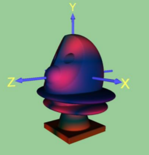

# Computer Graphics and Visuaization

* [Lab 1 : Visualization using Polygons](https://github.com/Atul-Acharya-17/CZ2003-Computer-Graphics-and-Visualization/blob/master/Lab%201/Lab%20Report/Lab%201.pdf)
* [Lab 2 : Parametric Curves](https://github.com/Atul-Acharya-17/CZ2003-Computer-Graphics-and-Visualization/blob/master/Lab%202/Lab%20Report/Lab%202.pdf)
* [Lab 3 : Parametric Surfaces and Solids](https://github.com/Atul-Acharya-17/CZ2003-Computer-Graphics-and-Visualization/blob/master/Lab%203/Lab%20Report/Lab%203.pdf)
* [Lab 4 : Implicit Solids](https://github.com/Atul-Acharya-17/CZ2003-Computer-Graphics-and-Visualization/blob/master/Lab%204/Lab%20Report/Lab%204.pdf)
* [Lab 5 :  Morphing](https://github.com/Atul-Acharya-17/CZ2003-Computer-Graphics-and-Visualization/blob/master/Lab%205/Lab%20Report/Lab%205%20Report.pdf)

---

# Example Figures

<h2>Polygons</h2>
 </img>
 </img>

 
 

<h2>Curves</h2>
 </img>
 </img>
 </img>
 </img>

 
 

<h2>Translational and Rotational Sweeping</h2>
 </img>

 
 

<h2>Surfaces</h2>
 </img>
 </img>
 </img>

 
 

<h2>Solids</h2>
 </img>
 </img>
 </img>

 
 

<h2>Implicit Solids</h2>
 </img>
 </img>
 </img>
 
 
 </img>
 </img>
 </img>

 
 

<h2>Morphing</h2>
 </img>

